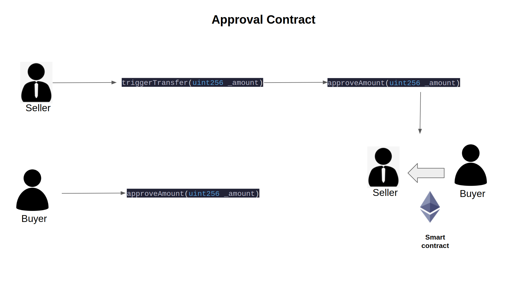

# approval-erc20

### Technology Uses

- Hardhat
  Ethereum development environment for professionals. Easily deploy your contracts, run tests and debug Solidity code without dealing with live environments. Hardhat Network is a local Ethereum network designed for development.

- Web3 Js
    web3.js is a collection of libraries that allow you to interact with a local or remote ethereum node using HTTP, IPC or WebSocket.

- ether.js
    The ethers.js library aims to be a complete and compact library for interacting with the Ethereum Blockchain and its ecosystem. It was originally designed for use with ethers.io and has since expanded into a more general-purpose library.

- React Js
    A JavaScript library for building user interfaces

- Openzeppelin
    OpenZeppelin provides security products to build, automate, and operate decentralized applications. We also protect leading organizations by performing security audits on their systems and products.

- Remix IDE
    Remix IDE is an open source web and desktop application. It fosters a fast development cycle and has a rich set of plugins with intuitive GUIs. Remix is used for the entire journey of contract development as well as act as a playground for learning and teaching Ethereum.

### Project Structure
`approval-frontend` -> Frontend of the application ( React Js )

`approval-contract` -> Hardhat Project (Our contract developed on Solidity)

### Methods available to call

- `approve(address spender, uint256 amount)` Sets amount as the allowance of spender over the caller’s tokens.
- `approveAmount(uint256 _amount)` custom function 
- `decreaseAllowance(address spender, uint256 subtractedValue)`
- `increaseAllowance(address spender, uint256 addedValue)`
- `setBuyer(address _buyer)` setter Function
- `setSeller(address _seller)` setter Function
- `transfer(address to, uint256 amount)` Moves amount tokens from the caller’s account to to.
- `transferFrom(address from, address to, uint256 amount)` Moves amount tokens from from to to using the allowance mechanism. amount is then deducted from the caller’s allowance.
- `transferFund(uint256 _amount)` custom function called by contract itself
- `triggerTransfer(uint256 _amount)` custom function called by seller
- `allowance(address owner, address spender)` Returns the remaining number of tokens that spender will be allowed to spend on behalf of owner through transferFrom. This is zero by default.
- `balanceOf(address amount)` Returns the amount of tokens owned by account.
- `buyer()` -> getter function return address of the buyer
- `decimals()`  -> getter function return decimals place of the token ( 10^18 )
- `name()` -> getter function return name of the token
- `seller()` -> getter function return address of seller
- `symbol()` -> getter function return symbol of the token
- `totalSupply()` -> getter function returns the amount of tokens in existence.

### dApp Flow

